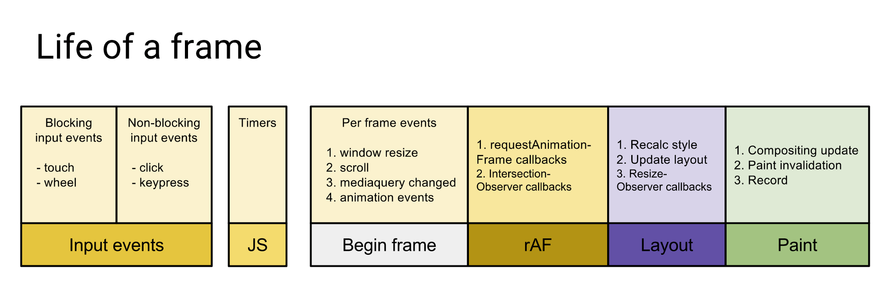

### requestIdleCallback
> requestIdleCallback是一个当浏览器处于闲置状态时，调用的方法 优先级很低
这会在某一帧结束后的空闲时间或者用户处于不活跃状态时处理的动作

> 浏览器的帧数大于60帧时 就认为是流畅的 所以 留给每帧的时间就只有 大概 1000/60 (16ms)左右
而每一帧需要完成
   1. 处理用户的交互行为 如点击，滚动，输入等事件
   2. js执行
   3. requestAnimation
   4. 布局和绘制


### requestIdleCallback 为什么需要
> 在网页中 有许多耗时 但又不是很紧急的任务 这时候防止和紧急抢资源 就需要 requestIdleCallback
requestIdleCallback 定义在空闲时间段执行的任务 会在帧结束时并且有空闲时间 或者网页无交互时 执行的回调

### 空闲时间
+ 当连续的帧执行时 帧与帧之间执行完其他任务时 如果还有空闲 就属于空闲时间
+ 当前没有任何网页交互 屏幕也没有动画执行 这时候也是属于空闲状态 但是为了避免紧急任务所以 最大空闲时间限制在50ms

### 用法

```js
const handle = window.requestIdleCallback(callback, option)
```
+ callback 执行的任务 回调接收一个IdleDeadline对象作为入参 这个对象包括
   + didTimeout 表示是否超时
   + timeRemaining 表示剩余的时间
+ option(可选) 参数 {timeout} 最长等待时间 如果超过这个时间 将强制执行 一般不设置这种

返回一个Id 可以用 window.cancelIdleCallback() 方法取消

### 作用 
1. 可以用于数据上报 或者监控行为等
2. 懒加载等


---

## requestAnimationFrame
> 这个是请求动画帧 在每一帧中执行 属于优先级比较高的任务

+ 注意: 需要在requestAnimationFrame 中重复调用 否者 只会调用一帧

如下示例
```js
const element = document.getElementById('some-element-you-want-to-animate');
let start;

function step(timestamp) {
  if (start === undefined)
    start = timestamp;
  const elapsed = timestamp - start;

  //这里使用`Math.min()`确保元素刚好停在200px的位置。
  element.style.transform = 'translateX(' + Math.min(0.1 * elapsed, 200) + 'px)';

  if (elapsed < 2000) { // 在两秒后停止动画
    window.requestAnimationFrame(step);
  }
}

window.requestAnimationFrame(step);
```